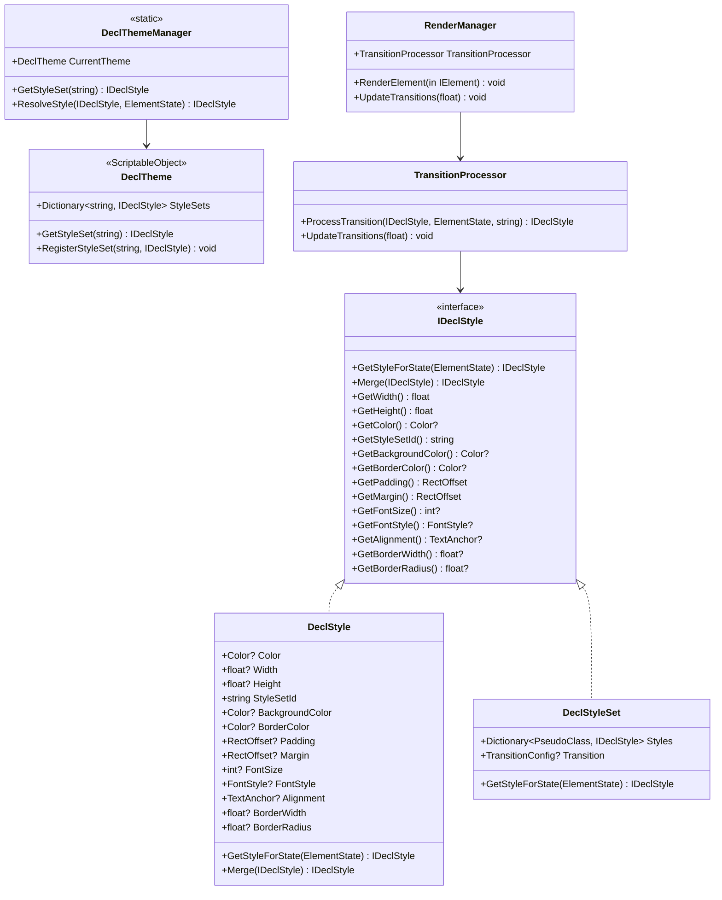

# DeclGUI 完整样式系统设计文档

## 设计目标

为 DeclGUI 框架设计一个完整的样式系统，支持：
1. **伪类（Pseudo-classes）**：支持悬停、激活、焦点、禁用等状态
2. **过渡效果（Transitions）**：支持样式属性的平滑过渡动画
3. **主题管理**：通过 ScriptableObject 支持可视化主题配置
4. **扩展样式属性**：支持 Padding、Margin、FontSize 等常用样式属性
5. **完全向后兼容**：保持所有现有代码无需修改
6. **IMGUI 兼容**：适合每帧构建模式，避免堆分配

## 系统架构



## 核心接口和结构体

### 1. IDeclStyle 接口

```csharp
using UnityEngine;

namespace DeclGUI.Core
{
    /// <summary>
    /// 声明式样式接口
    /// 不直接操作 GUIStyle，由渲染器负责样式应用
    /// </summary>
    public interface IDeclStyle
    {
        /// <summary>
        /// 根据元素状态获取对应的样式
        /// </summary>
        IDeclStyle GetStyleForState(ElementState elementState);
        
        /// <summary>
        /// 合并另一个样式（返回新实例）
        /// </summary>
        IDeclStyle Merge(IDeclStyle other);
        
        // 尺寸属性
        float GetWidth();
        float GetHeight();
        
        // 颜色属性
        Color? GetColor();
        Color? GetBackgroundColor();
        Color? GetBorderColor();
        
        // 布局属性
        RectOffset GetPadding();
        RectOffset GetMargin();
        
        // 文本属性
        int? GetFontSize();
        FontStyle? GetFontStyle();
        TextAnchor? GetAlignment();
        
        // 边框属性
        float? GetBorderWidth();
        float? GetBorderRadius();
        
        // 样式集引用
        string GetStyleSetId();
    }
}
```

### 2. DeclStyle 结构体（扩展字段）

```csharp
using UnityEngine;

namespace DeclGUI.Core
{
    /// <summary>
    /// 扩展的DeclStyle结构体
    /// 支持更多样式属性，保持每帧构建兼容性
    /// </summary>
    public struct DeclStyle : IDeclStyle
    {
        // 基础属性
        public Color? Color { get; }
        public float? Width { get; }
        public float? Height { get; }
        public string StyleSetId { get; }
        
        // 新增：背景和边框颜色
        public Color? BackgroundColor { get; }
        public Color? BorderColor { get; }
        
        // 新增：布局属性
        public RectOffset? Padding { get; }
        public RectOffset? Margin { get; }
        
        // 新增：文本属性
        public int? FontSize { get; }
        public FontStyle? FontStyle { get; }
        public TextAnchor? Alignment { get; }
        
        // 新增：边框属性
        public float? BorderWidth { get; }
        public float? BorderRadius { get; }
        
        // 主要构造函数（支持所有属性）
        public DeclStyle(
            Color? color = null,
            float? width = null,
            float? height = null,
            string styleSetId = null,
            Color? backgroundColor = null,
            Color? borderColor = null,
            RectOffset? padding = null,
            RectOffset? margin = null,
            int? fontSize = null,
            FontStyle? fontStyle = null,
            TextAnchor? alignment = null,
            float? borderWidth = null,
            float? borderRadius = null)
        {
            Color = color;
            Width = width;
            Height = height;
            StyleSetId = styleSetId;
            BackgroundColor = backgroundColor;
            BorderColor = borderColor;
            Padding = padding;
            Margin = margin;
            FontSize = fontSize;
            FontStyle = fontStyle;
            Alignment = alignment;
            BorderWidth = borderWidth;
            BorderRadius = borderRadius;
        }
        
        // 样式ID专用构造函数
        public DeclStyle(string styleSetId) : this()
        {
            StyleSetId = styleSetId;
        }
        
        // 颜色专用构造函数
        public DeclStyle(Color color) : this()
        {
            Color = color;
        }
        
        // 尺寸专用构造函数
        public DeclStyle(float width, float height) : this()
        {
            Width = width;
            Height = height;
        }
        
        public IDeclStyle GetStyleForState(ElementState elementState)
        {
            // 解析样式集引用
            if (!string.IsNullOrEmpty(StyleSetId))
            {
                var theme = DeclThemeManager.CurrentTheme;
                if (theme != null)
                {
                    var styleSet = theme.GetStyleSet(StyleSetId);
                    if (styleSet != null)
                    {
                        return styleSet.GetStyleForState(elementState).Merge(this);
                    }
                }
            }
            
            return this;
        }
        
        public IDeclStyle Merge(IDeclStyle other)
        {
            if (other == null) return this;
            
            return new DeclStyle(
                color: other.GetColor() ?? Color,
                width: other.GetWidth() ?? Width,
                height: other.GetHeight() ?? Height,
                styleSetId: StyleSetId, // 保持原样式集ID
                backgroundColor: other.GetBackgroundColor() ?? BackgroundColor,
                borderColor: other.GetBorderColor() ?? BorderColor,
                padding: other.GetPadding() ?? Padding,
                margin: other.GetMargin() ?? Margin,
                fontSize: other.GetFontSize() ?? FontSize,
                fontStyle: other.GetFontStyle() ?? FontStyle,
                alignment: other.GetAlignment() ?? Alignment,
                borderWidth: other.GetBorderWidth() ?? BorderWidth,
                borderRadius: other.GetBorderRadius() ?? BorderRadius
            );
        }
        
        // 接口实现
        public float GetWidth() => Width ?? 0;
        public float GetHeight() => Height ?? 0;
        public Color? GetColor() => Color;
        public Color? GetBackgroundColor() => BackgroundColor;
        public Color? GetBorderColor() => BorderColor;
        public RectOffset GetPadding() => Padding ?? new RectOffset();
        public RectOffset GetMargin() => Margin ?? new RectOffset();
        public int? GetFontSize() => FontSize;
        public FontStyle? GetFontStyle() => FontStyle;
        public TextAnchor? GetAlignment() => Alignment;
        public float? GetBorderWidth() => BorderWidth;
        public float? GetBorderRadius() => BorderRadius;
        public string GetStyleSetId() => StyleSetId;
    }
}
```

### 3. DeclStyleSet 类（高级样式）

```csharp
using System.Collections.Generic;
using UnityEngine;

namespace DeclGUI.Core
{
    /// <summary>
    /// 高级样式集实现（class 版本）
    /// 支持伪类和过渡效果
    /// </summary>
    public class DeclStyleSet : IDeclStyle
    {
        public Dictionary<PseudoClass, IDeclStyle> Styles { get; } = 
            new Dictionary<PseudoClass, IDeclStyle>();
        
        public TransitionConfig? Transition { get; set; }
        
        public IDeclStyle GetStyleForState(ElementState elementState)
        {
            var pseudoClass = DeterminePseudoClass(elementState);
            
            if (Styles.TryGetValue(pseudoClass, out var style))
            {
                return style;
            }
            
            // 返回默认样式或空样式
            return Styles.TryGetValue(PseudoClass.Normal, out var defaultStyle) 
                ? defaultStyle 
                : new DeclStyle();
        }
        
        public IDeclStyle Merge(IDeclStyle other)
        {
            // 样式集不支持合并，返回自身
            return this;
        }
        
        public float GetWidth() => 0; // 需要具体状态
        public float GetHeight() => 0; // 需要具体状态
        public Color? GetColor() => null; // 需要具体状态
        public Color? GetBackgroundColor() => null; // 需要具体状态
        public Color? GetBorderColor() => null; // 需要具体状态
        public RectOffset GetPadding() => new RectOffset(); // 需要具体状态
        public RectOffset GetMargin() => new RectOffset(); // 需要具体状态
        public int? GetFontSize() => null; // 需要具体状态
        public FontStyle? GetFontStyle() => null; // 需要具体状态
        public TextAnchor? GetAlignment() => null; // 需要具体状态
        public float? GetBorderWidth() => null; // 需要具体状态
        public float? GetBorderRadius() => null; // 需要具体状态
        public string GetStyleSetId() => null; // 样式集本身没有ID
        
        private PseudoClass DeterminePseudoClass(ElementState elementState)
        {
            if (elementState.HoverState?.IsHovering == true)
                return PseudoClass.Hover;
            
            return PseudoClass.Normal;
        }
    }
}
```

### 4. 伪类枚举

```csharp
namespace DeclGUI.Core
{
    /// <summary>
    /// 伪类枚举定义
    /// </summary>
    public enum PseudoClass
    {
        Normal,    // 默认状态
        Hover,     // 鼠标悬停
        Active,    // 激活状态（如按钮按下）
        Focus,     // 获得焦点
        Disabled   // 禁用状态
    }
}
```

### 5. 过渡配置结构

```csharp
using UnityEngine;

namespace DeclGUI.Core
{
    /// <summary>
    /// 过渡效果配置
    /// </summary>
    public struct TransitionConfig
    {
        public float Duration;          // 过渡持续时间（秒）
        public AnimationCurve EasingCurve; // 缓动曲线
        public string[] Properties;     // 应用过渡的属性列表
        
        public static TransitionConfig Default => new TransitionConfig
        {
            Duration = 0.3f,
            EasingCurve = AnimationCurve.EaseInOut(0, 0, 1, 1),
            Properties = new[] { "color", "width", "height", "background-color", "border-color" }
        };
    }
}
```

## 主题管理系统

### 1. DeclTheme（ScriptableObject 主题）

```csharp
using System.Collections.Generic;
using UnityEngine;

namespace DeclGUI.Core
{
    /// <summary>
    /// DeclGUI 主题配置
    /// 使用 ScriptableObject 支持可视化编辑
    /// </summary>
    [CreateAssetMenu(fileName = "NewDeclTheme", menuName = "DeclGUI/Theme")]
    public class DeclTheme : ScriptableObject
    {
        [SerializeField]
        private List<StyleSetEntry> styleSets = new List<StyleSetEntry>();
        
        private Dictionary<string, IDeclStyle> _styleSetCache;
        
        /// <summary>
        /// 获取样式集
        /// </summary>
        public IDeclStyle GetStyleSet(string id)
        {
            if (_styleSetCache == null)
                BuildCache();
            
            return _styleSetCache.TryGetValue(id, out var styleSet) ? styleSet : null;
        }
        
        /// <summary>
        /// 注册样式集
        /// </summary>
        public void RegisterStyleSet(string id, IDeclStyle styleSet)
        {
            if (_styleSetCache == null)
                BuildCache();
            
            _styleSetCache[id] = styleSet;
            
            // 更新序列化数据
            var entry = styleSets.Find(e => e.Id == id);
            if (entry == null)
            {
                entry = new StyleSetEntry { Id = id };
                styleSets.Add(entry);
            }
            
            if (styleSet is DeclStyleSet styleSetImpl)
            {
                entry.StyleSet = styleSetImpl;
            }
        }
        
        private void BuildCache()
        {
            _styleSetCache = new Dictionary<string, IDeclStyle>();
            foreach (var entry in styleSets)
            {
                if (!string.IsNullOrEmpty(entry.Id) && entry.StyleSet != null)
                {
                    _styleSetCache[entry.Id] = entry.StyleSet;
                }
            }
        }
        
        [System.Serializable]
        private class StyleSetEntry
        {
            public string Id;
            public DeclStyleSet StyleSet;
        }
    }
}
```

### 2. DeclThemeManager（静态管理器）

```csharp
using UnityEngine;

namespace DeclGUI.Core
{
    /// <summary>
    /// DeclGUI 主题管理器
    /// 提供全局主题访问和样式集解析
    /// </summary>
    public static class DeclThemeManager
    {
        private static DeclTheme _currentTheme;
        
        /// <summary>
        /// 当前主题
        /// </summary>
        public static DeclTheme CurrentTheme
        {
            get => _currentTheme;
            set
            {
                _currentTheme = value;
                OnThemeChanged?.Invoke(value);
            }
        }
        
        /// <summary>
        /// 主题变更事件
        /// </summary>
        public static event System.Action<DeclTheme> OnThemeChanged;
        
        /// <summary>
        /// 获取样式集
        /// </summary>
        public static IDeclStyle GetStyleSet(string id)
        {
            return CurrentTheme?.GetStyleSet(id);
        }
        
        /// <summary>
        /// 解析样式（处理样式集引用）
        /// </summary>
        public static IDeclStyle ResolveStyle(IDeclStyle style, ElementState elementState = null)
        {
            if (style == null) return null;
            
            // 如果有样式集ID，先解析样式集
            var styleSetId = style.GetStyleSetId();
            if (!string.IsNullOrEmpty(styleSetId))
            {
                var styleSet = GetStyleSet(styleSetId);
                if (styleSet != null)
                {
                    var resolvedStyle = styleSet.GetStyleForState(elementState ?? new ElementState());
                    return resolvedStyle.Merge(style);
                }
            }
            
            return style;
        }
    }
}
```

## 过渡效果系统

### TransitionProcessor 类

```csharp
using System.Collections.Generic;
using UnityEngine;

namespace DeclGUI.Core
{
    /// <summary>
    /// 过渡效果处理器
    /// 专门负责处理样式过渡动画
    /// </summary>
    public class TransitionProcessor
    {
        private class TransitionState
        {
            public IDeclStyle FromStyle { get; set; }
            public IDeclStyle ToStyle { get; set; }
            public float StartTime { get; set; }
            public float Duration { get; set; }
            public AnimationCurve EasingCurve { get; set; }
            public string[] Properties { get; set; }
        }
        
        private readonly Dictionary<string, TransitionState> _activeTransitions = 
            new Dictionary<string, TransitionState>();
        
        private float _currentTime;
        
        /// <summary>
        /// 处理样式过渡
        /// </summary>
        public IDeclStyle ProcessTransition(IDeclStyle targetStyle, ElementState elementState, string elementKey)
        {
            if (targetStyle == null || elementState == null || string.IsNullOrEmpty(elementKey))
                return targetStyle;
            
            // 检查是否需要开始新过渡
            if (ShouldStartTransition(targetStyle, elementState, elementKey))
            {
                StartTransition(targetStyle, elementState, elementKey);
            }
            
            // 获取当前过渡状态
            if (_activeTransitions.TryGetValue(elementKey, out var transition))
            {
                return GetCurrentTransitionStyle(transition);
            }
            
            return targetStyle;
        }
        
        /// <summary>
        /// 更新所有活跃的过渡
        /// </summary>
        public void UpdateTransitions(float deltaTime)
        {
            _currentTime += deltaTime;
            
            // 清理完成的过渡
            var keysToRemove = new List<string>();
            foreach (var kvp in _activeTransitions)
            {
                var transition = kvp.Value;
                if (_currentTime - transition.StartTime >= transition.Duration)
                {
                    keysToRemove.Add(kvp.Key);
                }
            }
            
            foreach (var key in keysToRemove)
            {
                _activeTransitions.Remove(key);
            }
        }
        
        private bool ShouldStartTransition(IDeclStyle targetStyle, ElementState elementState, string elementKey)
        {
            // 检查样式是否有过渡配置
            // 检查元素状态是否发生变化
            // 这里需要具体实现状态变化检测逻辑
            return true; // 简化实现
        }
        
        private void StartTransition(IDeclStyle targetStyle, ElementState elementState, string elementKey)
        {
            // 创建新的过渡状态
            var transition = new TransitionState
            {
                FromStyle = GetCurrentStyle(elementKey), // 需要实现当前样式获取
                ToStyle = targetStyle,
                StartTime = _currentTime,
                Duration = 0.3f, // 从配置获取
                EasingCurve = AnimationCurve.EaseInOut(0, 0, 1, 1), // 默认缓动曲线
                Properties = new[] { "color", "width", "height" } // 从配置获取
            };
            
            _activeTransitions[elementKey] = transition;
        }
        
        private IDeclStyle GetCurrentTransitionStyle(TransitionState transition)
        {
            float progress = Mathf.Clamp01((_currentTime - transition.StartTime) / transition.Duration);
            float easedProgress = transition.EasingCurve.Evaluate(progress);
            
            return InterpolateStyles(transition.FromStyle, transition.ToStyle, easedProgress);
        }
        
        private IDeclStyle InterpolateStyles(IDeclStyle from, IDeclStyle to, float progress)
        {
            // 颜色插值
            Color? color = InterpolateColor(from.GetColor(), to.GetColor(), progress);
            Color? backgroundColor = InterpolateColor(from.GetBackgroundColor(), to.GetBackgroundColor(), progress);
            Color? borderColor = InterpolateColor(from.GetBorderColor(), to.GetBorderColor(), progress);
            
            // 尺寸插值
            float width = Mathf.Lerp(from.GetWidth(), to.GetWidth(), progress);
            float height = Mathf.Lerp(from.GetHeight(), to.GetHeight(), progress);
            float borderWidth = Mathf.Lerp(from.GetBorderWidth() ?? 0, to.GetBorderWidth() ?? 0, progress);
            float borderRadius = Mathf.Lerp(from.GetBorderRadius() ?? 0, to.GetBorderRadius() ?? 0, progress);
            
            // 布局属性插值
            RectOffset padding = InterpolateRectOffset(from.GetPadding(), to.GetPadding(), progress);
            RectOffset margin = InterpolateRectOffset(from.GetMargin(), to.GetMargin(), progress);
            
            // 文本属性（离散值，不插值）
            int? fontSize = progress >= 0.5f ? to.GetFontSize() : from.GetFontSize();
            FontStyle? fontStyle = progress >= 0.5f ? to.GetFontStyle() : from.GetFontStyle();
            TextAnchor? alignment = progress >= 0.5f ? to.GetAlignment() : from.GetAlignment();
            
            return new DeclStyle(
                color: color,
                width: width,
                height: height,
                backgroundColor: backgroundColor,
                borderColor: borderColor,
                padding: padding,
                margin: margin,
                fontSize: fontSize,
                fontStyle: fontStyle,
                alignment: alignment,
                borderWidth: borderWidth,
                borderRadius: borderRadius
            );
        }
        
        private Color? InterpolateColor(Color? from, Color? to, float progress)
        {
            if (!from.HasValue && !to.HasValue) return null;
            if (!from.HasValue) return to;
            if (!to.HasValue) return from;
            
            return Color.Lerp(from.Value, to.Value, progress);
        }
        
        private RectOffset InterpolateRectOffset(RectOffset from, RectOffset to, float progress)
        {
            return new RectOffset(
                Mathf.RoundToInt(Mathf.Lerp(from.left, to.left, progress)),
                Mathf.RoundToInt(Mathf.Lerp(from.right, to.right, progress)),
                Mathf.RoundToInt(Mathf.Lerp(from.top, to.top, progress)),
                Mathf.RoundToInt(Mathf.Lerp(from.bottom, to.bottom, progress))
            );
        }
        
        private IDeclStyle GetCurrentStyle(string elementKey)
        {
            // 需要实现当前样式获取逻辑
            // 可以从渲染管理器或元素状态获取
            return new DeclStyle();
        }
    }
}
```

## 样式构建器模式

为了更方便地创建复杂的样式，可以添加样式构建器：

```csharp
namespace DeclGUI.Core
{
    /// <summary>
    /// DeclStyle 构建器
    /// 提供流畅的API创建复杂样式
    /// </summary>
    public class DeclStyleBuilder
    {
        private DeclStyle _style;
        
        public DeclStyleBuilder()
        {
            _style = new DeclStyle();
        }
        
        public DeclStyleBuilder WithColor(Color color)
        {
            _style = new DeclStyle(color: color).Merge(_style);
            return this;
        }
        
        public DeclStyleBuilder WithWidth(float width)
        {
            _style = new DeclStyle(width: width).Merge(_style);
            return this;
        }
        
        public DeclStyleBuilder WithHeight(float height)
        {
            _style = new DeclStyle(height: height).Merge(_style);
            return this;
        }
        
        public DeclStyleBuilder WithStyleSetId(string styleSetId)
        {
            _style = new DeclStyle(styleSetId: styleSetId).Merge(_style);
            return this;
        }
        
        public DeclStyleBuilder WithBackgroundColor(Color backgroundColor)
        {
            _style = new DeclStyle(backgroundColor: backgroundColor).Merge(_style);
            return this;
        }
        
        public DeclStyleBuilder WithBorderColor(Color borderColor)
        {
            _style = new DeclStyle(borderColor: borderColor).Merge(_style);
            return this;
        }
        
        public DeclStyleBuilder WithPadding(RectOffset padding)
        {
            _style = new DeclStyle(padding: padding).Merge(_style);
            return this;
        }
        
        public DeclStyleBuilder WithPadding(int left, int right, int top, int bottom)
        {
            return WithPadding(new RectOffset(left, right, top, bottom));
        }
        
        public DeclStyleBuilder WithMargin(RectOffset margin)
        {
            _style = new DeclStyle(margin: margin).Merge(_style);
            return this;
        }
        
        public DeclStyleBuilder WithFontSize(int fontSize)
        {
            _style = new DeclStyle(fontSize: fontSize).Merge(_style);
            return this;
        }
        
        public DeclStyleBuilder WithFontStyle(FontStyle fontStyle)
        {
            _style = new DeclStyle(fontStyle: fontStyle).Merge(_style);
            return this;
        }
        
        public DeclStyleBuilder WithAlignment(TextAnchor alignment)
        {
            _style = new DeclStyle(alignment: alignment).Merge(_style);
            return this;
        }
        
        public DeclStyleBuilder WithBorderWidth(float borderWidth)
        {
            _style = new DeclStyle(borderWidth: borderWidth).Merge(_style);
            return this;
        }
        
        public DeclStyleBuilder WithBorderRadius(float borderRadius)
        {
            _style = new DeclStyle(borderRadius: borderRadius).Merge(_style);
            return this;
        }
        
        public DeclStyle Build()
        {
            return _style;
        }
        
        // 隐式转换，方便使用
        public static implicit operator DeclStyle(DeclStyleBuilder builder)
        {
            return builder.Build();
        }
    }
}
```

## 渲染管理器集成

### RenderManager 扩展

```csharp
using UnityEngine;

namespace DeclGUI.Core
{
    public abstract class RenderManager
    {
        // ... 现有字段保持不变 ...
        
        /// <summary>
        /// 过渡效果处理器
        /// </summary>
        public TransitionProcessor TransitionProcessor { get; } = new TransitionProcessor();
        
        /// <summary>
        /// 更新过渡效果（每帧调用）
        /// </summary>
        public void UpdateTransitions(float deltaTime)
        {
            TransitionProcessor.UpdateTransitions(deltaTime);
        }
        
        /// <summary>
        /// 渲染元素（支持样式处理）
        /// </summary>
        public void RenderElement(in IElement element)
        {
            if (element == null)
                return;
            
            // 处理样式化元素
            if (element is IStylefulElement stylefulElement)
            {
                RenderStylefulElement(stylefulElement);
                return;
            }
            
            // ... 其他渲染逻辑保持不变 ...
        }
        
        /// <summary>
        /// 渲染具有样式的元素
        /// </summary>
        private void RenderStylefulElement(IStylefulElement element)
        {
            // 获取元素状态
            ElementState elementState = null;
            if (!StateStack.IsEmpty())
            {
                elementState = StateStack.CurrentStateManager.GetOrCreateState(element);
            }
            
            // 解析样式（处理样式集引用）
            IDeclStyle resolvedStyle = DeclThemeManager.ResolveStyle(element.Style, elementState);
            
            // 应用过渡效果
            IDeclStyle finalStyle = TransitionProcessor.ProcessTransition(
                resolvedStyle, elementState, element.Key);
            
            // 渲染元素
            RenderElementWithStyle(element, finalStyle);
        }
        
        /// <summary>
        /// 使用样式渲染元素（抽象方法）
        /// </summary>
        protected abstract void RenderElementWithStyle(IStylefulElement element, IDeclStyle style);
    }
}
```

### IStylefulElement 接口

```csharp
namespace DeclGUI.Core
{
    /// <summary>
    /// 具有样式的元素接口
    /// </summary>
    public interface IStylefulElement : IElementWithKey
    {
        /// <summary>
        /// 元素样式
        /// </summary>
        IDeclStyle Style { get; }
    }
}
```

## 使用示例

### 1. 创建主题配置

```csharp
// 在 Unity Editor 中创建 DeclTheme Asset
// 通过菜单 Create/DeclGUI/Theme 创建主题文件

// 代码中注册样式集
var theme = ScriptableObject.CreateInstance<DeclTheme>();

var buttonStyles = new DeclStyleSet();
buttonStyles.Styles[PseudoClass.Normal] = new DeclStyle(
    color: Color.blue,
    backgroundColor: Color.white,
    borderRadius: 4f
);
buttonStyles.Styles[PseudoClass.Hover] = new DeclStyle(
    color: Color.cyan,
    backgroundColor: Color.lightGray
);
buttonStyles.Styles[PseudoClass.Active] = new DeclStyle(
    color: Color.red,
    backgroundColor: Color.darkGray
);

theme.RegisterStyleSet("PrimaryButton", buttonStyles);
DeclThemeManager.CurrentTheme = theme;
```

### 2. 使用样式集引用

```csharp
// 使用样式集引用
var button = new Button(
    "Click Me",
    onClick,
    new DeclStyle(styleSetId: "PrimaryButton")
);

// 混合使用基础属性和样式集
var styledButton = new Button(
    "Click Me",
    onClick,
    new DeclStyle(
        width: 100,
        height: 30,
        styleSetId: "PrimaryButton" // 颜色等样式从样式集获取
    )
);
```

### 3. 使用构建器创建复杂样式

```csharp
// 使用构建器模式
var buttonStyle = new DeclStyleBuilder()
    .WithStyleSetId("PrimaryButton")
    .WithWidth(120)
    .WithHeight(40)
    .WithPadding(12, 12, 8, 8)
    .WithFontSize(14)
    .WithBorderRadius(6)
    .Build();

var button = new Button("Click Me", onClick, buttonStyle);
```

### 4. 自定义过渡效果

```csharp
// 创建自定义过渡处理器
public class CustomTransitionProcessor : TransitionProcessor
{
    public override IDeclStyle ProcessTransition(IDeclStyle targetStyle, ElementState elementState, string elementKey)
    {
        // 自定义过渡逻辑
        if (elementState.HoverState?.IsHovering == true)
        {
            // 悬停时使用特殊过渡
            return HandleHoverTransition(targetStyle, elementState);
        }
        
        return base.ProcessTransition(targetStyle, elementState, elementKey);
    }
    
    private IDeclStyle HandleHoverTransition(IDeclStyle targetStyle, ElementState elementState)
    {
        // 自定义悬停过渡实现
        return targetStyle;
    }
}

// 在渲染管理器中使用自定义处理器
var renderManager = new EditorRenderManager();
renderManager.TransitionProcessor = new CustomTransitionProcessor();
```

## 向后兼容性

### 1. 现有代码完全兼容

```csharp
// 现有代码继续工作
var button1 = new Button("Click", onClick, new DeclStyle(Color.red));
var button2 = new Button("Click", onClick, new DeclStyle(100, 30));

// 新的样式引用方式
var button3 = new Button("Click", onClick, new DeclStyle("PrimaryButton"));
```

### 2. 样式合并行为

```csharp
// 基础属性覆盖样式集属性
var button = new Button(
    "Click",
    onClick,
    new DeclStyle(
        color: Color.red, // 覆盖样式集中的颜色
        styleSetId: "PrimaryButton"
    )
);
```

## 实施计划

### 第一阶段：核心功能实现
1. 创建新的 DeclStyle 结构定义（支持扩展字段和样式ID）
2. 实现 IDeclStyle 接口
3. 实现 DeclStyleSet 类和伪类枚举
4. 实现过渡配置结构

### 第二阶段：主题管理系统
1. 创建 DeclTheme ScriptableObject
2. 实现 DeclThemeManager 静态类
3. 实现样式解析逻辑

### 第三阶段：过渡效果系统
1. 创建 TransitionProcessor 类
2. 实现样式插值计算
3. 集成到 RenderManager

### 第四阶段：渲染器适配
1. 修改 EditorRenderManager 支持新样式属性
2. 实现 IStylefulElement 接口
3. 更新元素渲染器

### 第五阶段：测试和验证
1. 创建测试用例验证向后兼容性
2. 测试伪类状态切换和过渡效果
3. 验证性能影响和内存使用

### 第六阶段：文档和示例
1. 更新 API 文档
2. 创建使用示例和最佳实践
3. 提供迁移指南

## 总结

这个完整的设计提供了 DeclGUI 框架的现代化样式系统：

1. **扩展样式属性**：支持 Padding、Margin、FontSize、Border 等常用属性
2. **伪类支持**：支持悬停、激活、焦点、禁用等状态
3. **主题管理**：通过 ScriptableObject 支持可视化配置
4. **过渡效果**：独立的 TransitionProcessor 处理样式动画
5. **构建器模式**：流畅的 API 创建复杂样式
6. **完全向后兼容**：现有代码无需修改
7. **IMGUI 兼容**：适合每帧构建模式

这个系统为创建精美的 DeclGUI 界面提供了强大的样式功能，同时保持了框架的简洁性和性能。